# 서비스 기능  

- [서비스 기능](#서비스-기능)
  - [일반 사용자](#일반-사용자)
  - [버스 기사](#버스-기사)
  - [관리자](#관리자)

## 일반 사용자  

|                        로그인 화면                        |
| :-------------------------------------------------------: |
| 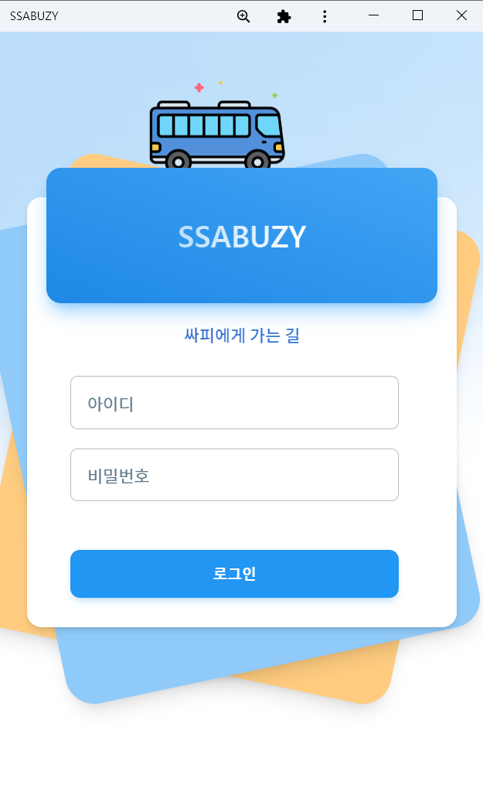 |

|                        메인 화면 1                        |                        메인 화면 2                        |                        메인 화면 3                        |
| :-------------------------------------------------------: | :-------------------------------------------------------: | :-------------------------------------------------------: |
|  |  | 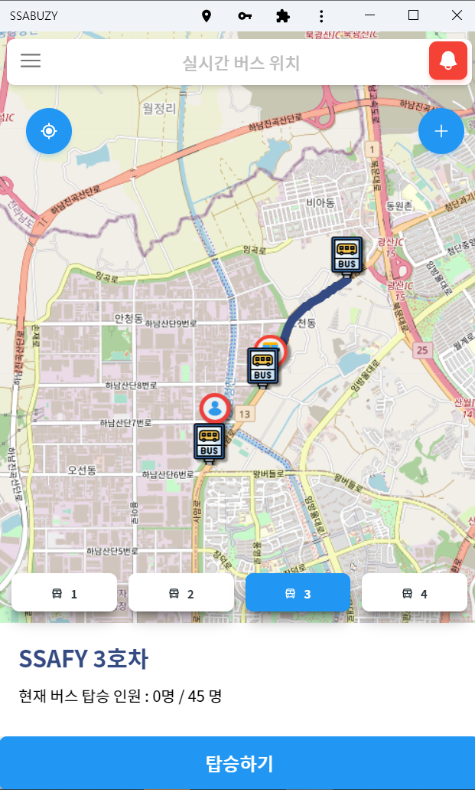 |

|                 버스 탑승 QR 코드 생성 화면                 |                  버스 탑승 QR 코드 화면                   |
| :---------------------------------------------------------: | :-------------------------------------------------------: |
| 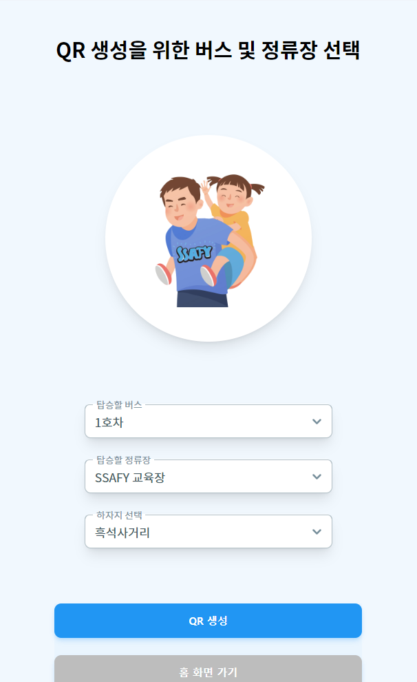 |  |

|                      신고 접수 화면                       |                    신고 접수 완료 화면                    |
| :-------------------------------------------------------: | :-------------------------------------------------------: |
|  | 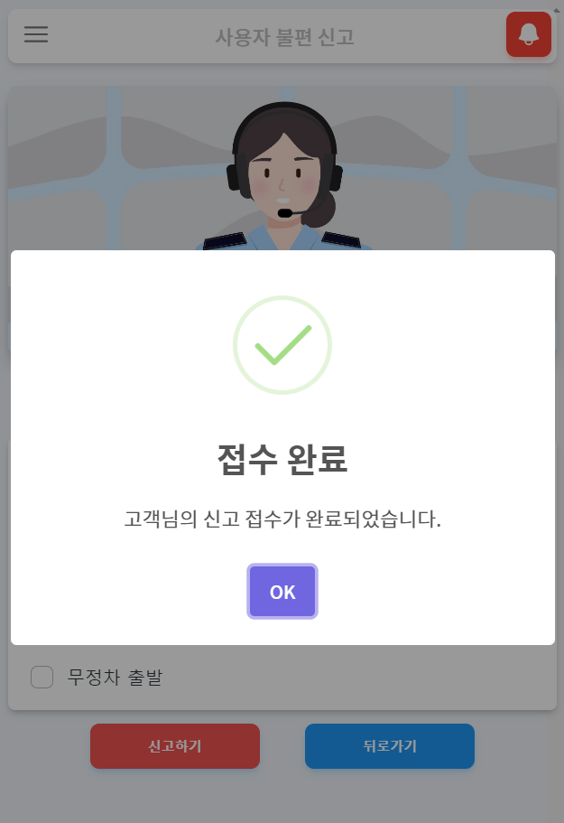 |

## 버스 기사  

|                       운행 시작 화면                        |                       운행 종료 화면                        |
| :---------------------------------------------------------: | :---------------------------------------------------------: |
| 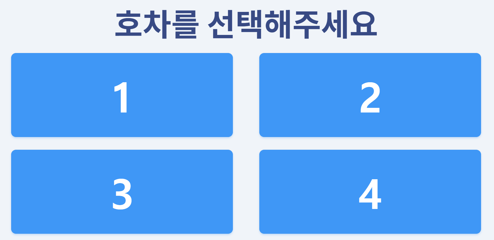 | 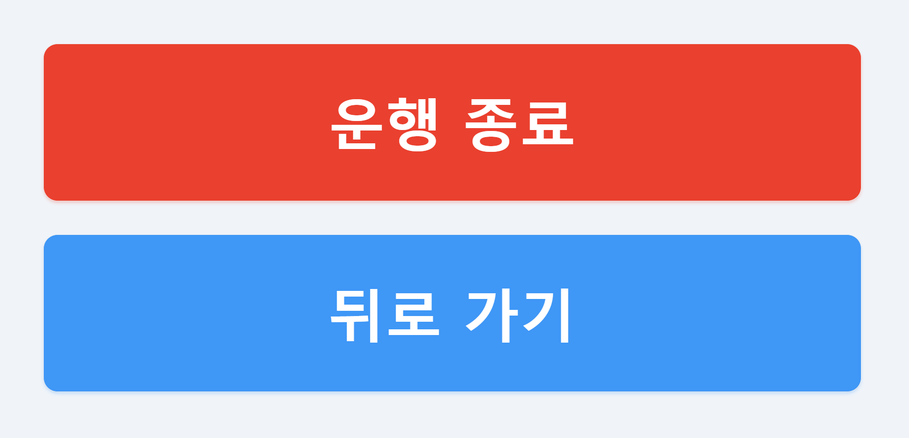 |

|                       운행 경로 화면                        |                     긴급 화상 통화 화면                     |
| :---------------------------------------------------------: | :---------------------------------------------------------: |
| 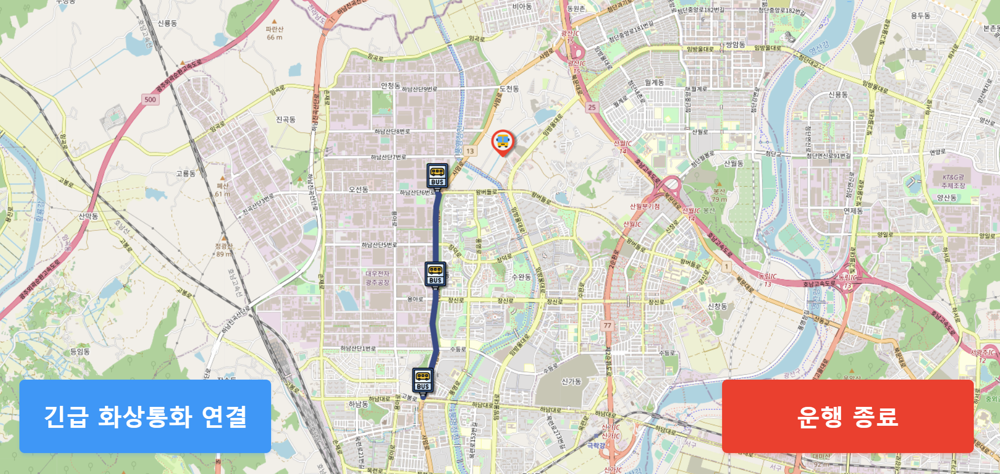 | 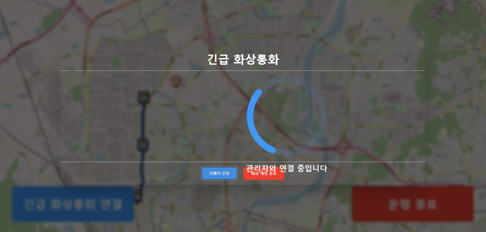 |

|                       QR 코드 인식 화면                       |
| :-----------------------------------------------------------: |
| 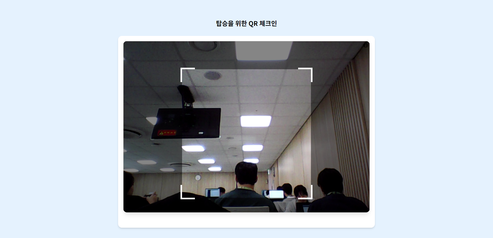 |

## 관리자  

|                       교육생 등록 화면                       |                      교육생 조회 화면                      |
| :----------------------------------------------------------: | :--------------------------------------------------------: |
| 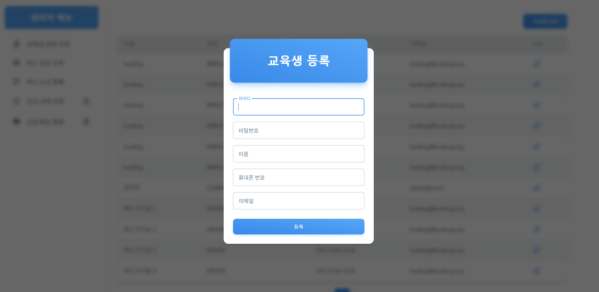 | 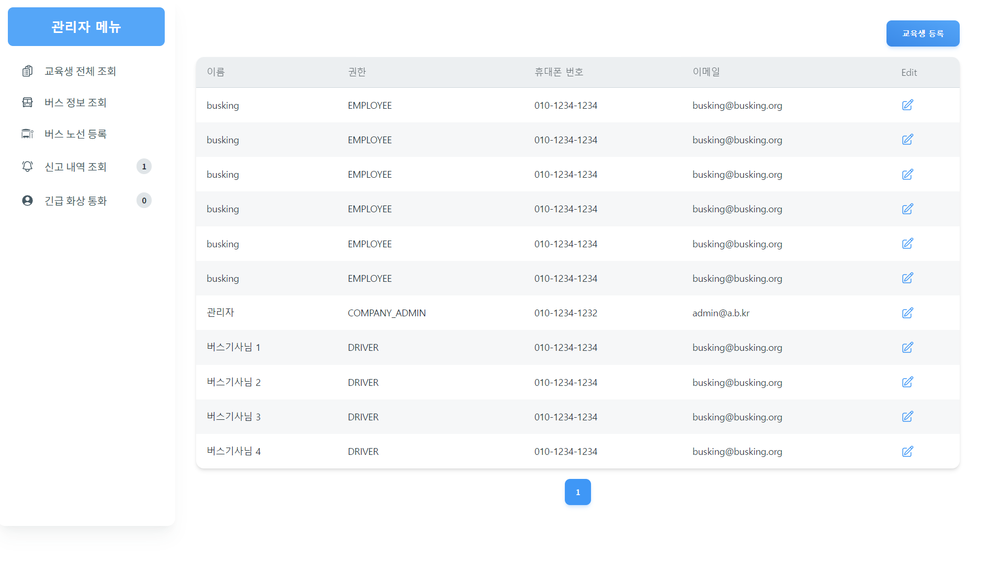 |

|                   셔틀버스 노선 등록 화면                    |                   셔틀버스 노선 조회 화면                    |
| :----------------------------------------------------------: | :----------------------------------------------------------: |
| 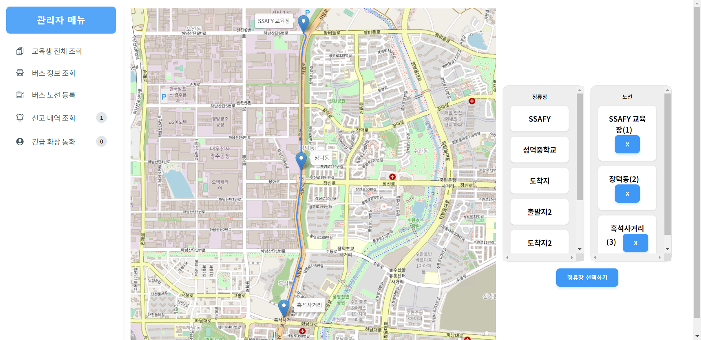 | 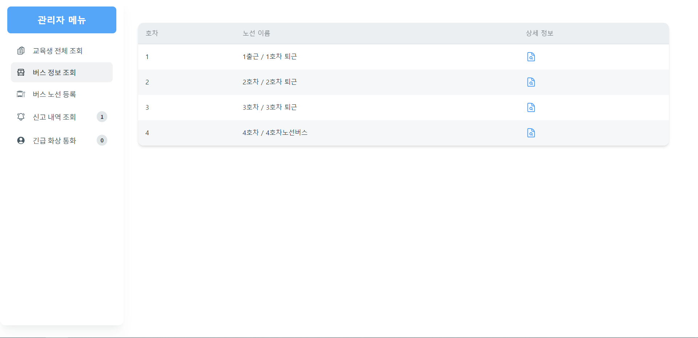 |

|                       긴급 화상통화 1                        |                       긴급 화상 통화 2                       |
| :----------------------------------------------------------: | :----------------------------------------------------------: |
| 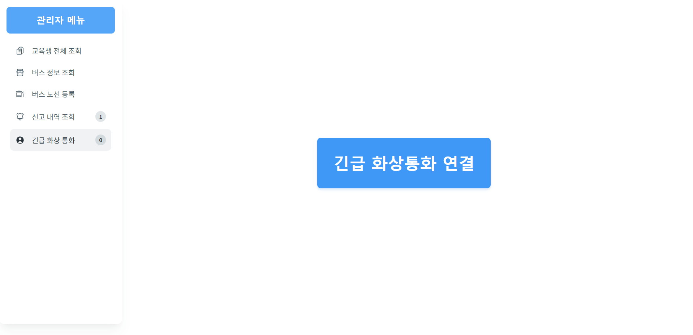 | 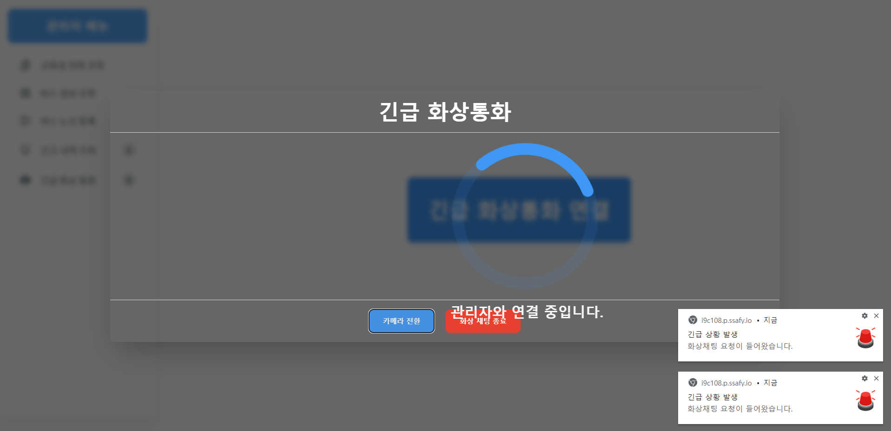 |

|                   셔틀버스 신고 조회 화면                    |
| :----------------------------------------------------------: |
| 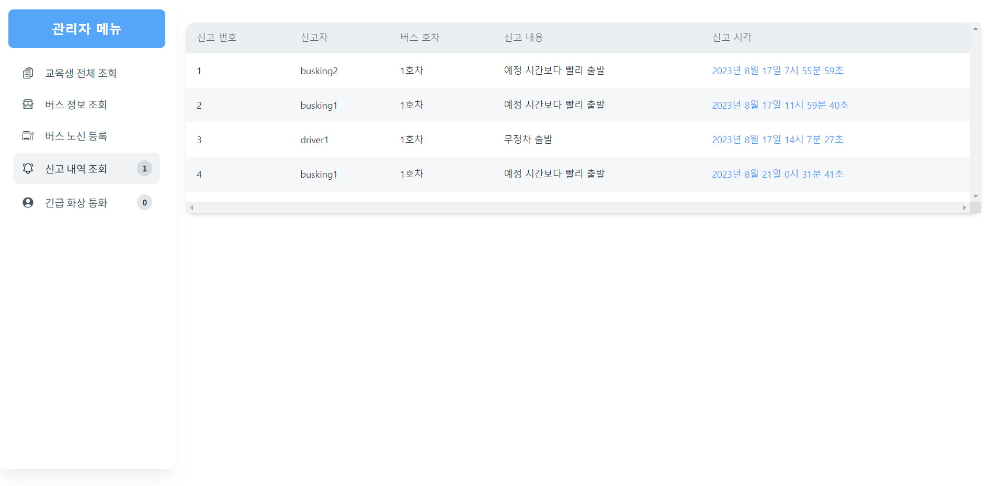 |